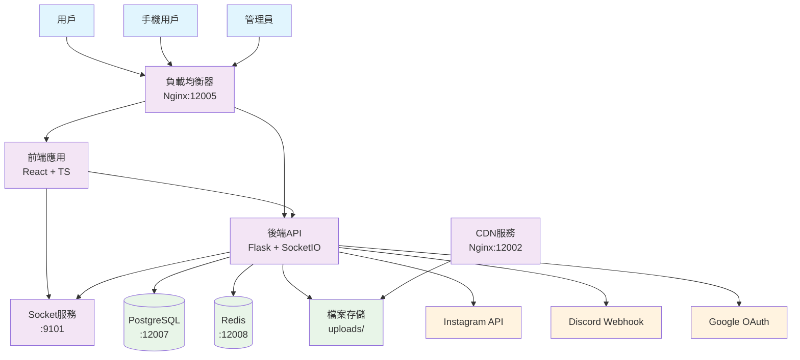

# ForumKit 系統架構文檔

## 概述

ForumKit 是一個新世代的校園匿名論壇系統，採用現代化的微服務架構，具備完整的內容審核機制、Instagram 整合、以及強大的安全防護功能。

## 技術棧

### 後端技術
- **框架**: Flask 3.0 + Flask-SocketIO 5.3
- **語言**: Python 3.12+
- **資料庫**: PostgreSQL 15 + Redis 7
- **ORM**: SQLAlchemy 2.0 + Alembic
- **認證**: JWT + bcrypt
- **容器化**: Docker + Docker Compose

### 前端技術
- **框架**: React 18 + TypeScript 5
- **建構工具**: Vite 4
- **樣式**: Tailwind CSS 3
- **狀態管理**: React Context + Hooks
- **即時通訊**: Socket.IO Client

### 基礎設施
- **反向代理**: Nginx
- **CDN**: 內建 Nginx CDN 服務
- **監控**: 自定義健康檢查
- **日誌**: Docker logs + 結構化日誌

## 系統架構圖



## 服務端口配置

| 服務 | 內部端口 | 外部端口 | 說明 |
|------|----------|----------|------|
| Web/API | 80 | 12005 | 主要服務入口 |
| CDN | 80 | 12002 | 媒體檔案服務 |
| PostgreSQL | 80 | 12007 | 資料庫服務 |
| Redis | 80 | 12008 | 快取與會話 |
| Socket Health | 9101 | 9101 | 原生 Socket 健康檢查 |

## 核心模組

### 1. 認證與授權模組
- **JWT 認證**: 無狀態 token 認證
- **角色系統**: admin, moderator, user
- **Google OAuth**: 校園信箱整合
- **匿名支援**: X-Client-Id 機制

### 2. 內容管理模組
- **貼文系統**: 創建、編輯、刪除、審核
- **留言系統**: 嵌套回覆與審核
- **媒體管理**: 上傳、審核、CDN 分發
- **審核工作流**: pending → approved/rejected

### 3. 學校管理模組
- **多校支援**: 跨校與校內內容分離
- **學校設定**: 個性化配置
- **Gmail 網域**: 校園信箱驗證
- **校徽管理**: Logo 上傳與展示

### 4. Instagram 整合模組
- **自動發布**: 貼文轉 IG 圖片
- **模板系統**: 可自定義樣式
- **排程機制**: 批量發布與定時發布
- **Discord 管理**: 遠程控制

### 5. 安全防護模組
- **內容過濾**: HTML 清理與 XSS 防護
- **速率限制**: IP 與用戶級別限流
- **檔案安全**: 類型檢查與路徑限制
- **CSP 防護**: 內容安全政策

## 資料流向

### 1. 用戶發文流程
```
用戶 → Frontend → Backend API → 內容清理 → 資料庫(pending) → 審核通知
```

### 2. 審核流程
```
管理員 → 審核頁面 → 審核決定 → 資料庫更新 → Socket 廣播 → 前端更新
```

### 3. Instagram 發布流程
```
定時器 → 獲取已審核貼文 → 生成圖片 → Instagram API → 更新狀態
```

### 4. 媒體上傳流程
```
用戶 → 上傳檔案 → pending/ → 安全檢查 → 審核 → public/ → CDN
```

## 安全架構

### 1. 網路安全
- **HTTPS 強制**: 生產環境必須
- **CORS 控制**: 嚴格的跨域政策
- **CSP 標頭**: 防止 XSS 攻擊
- **安全標頭**: X-Frame-Options, X-Content-Type-Options

### 2. 認證安全
- **JWT 簽名**: 防篡改 token
- **密碼哈希**: bcrypt 強化
- **會話管理**: Redis 存儲
- **角色驗證**: 多層權限檢查

### 3. 輸入安全
- **內容清理**: Bleach 白名單過濾
- **檔案檢查**: MIME 類型與內容驗證
- **SQL 注入**: SQLAlchemy ORM 防護
- **路徑遍歷**: 嚴格路徑檢查

### 4. 資料安全
- **敏感資料**: 環境變數管理
- **資料庫**: 連接加密
- **檔案存儲**: 分離式存取控制
- **日誌**: 脫敏處理

## 擴展性設計

### 1. 水平擴展
- **無狀態設計**: JWT + Redis 會話
- **資料庫分離**: 讀寫分離準備
- **CDN 分離**: 靜態資源外部化
- **微服務就緒**: 模組化架構

### 2. 性能優化
- **Redis 快取**: 熱點資料快取
- **資料庫索引**: 查詢優化
- **前端快取**: Browser Cache + CDN
- **圖片優化**: WebP 格式支援

### 3. 監控與維護
- **健康檢查**: HTTP + Socket 雙重檢查
- **日誌集中**: 結構化日誌輸出
- **錯誤追蹤**: 詳細錯誤信息
- **性能監控**: 資源使用追蹤

## 部署架構

### 開發環境
```
Docker Compose → 本地容器 → 開發資料庫 → 本地檔案系統
```

### 生產環境
```
Load Balancer → Docker Swarm/K8s → External DB → NFS/S3 Storage
```

## API 設計原則

### 1. RESTful API
- **資源導向**: /api/posts, /api/schools
- **HTTP 方法**: GET, POST, PUT, DELETE
- **狀態碼**: 標準 HTTP 狀態碼
- **JSON 格式**: 統一資料格式

### 2. 認證授權
- **Bearer Token**: Authorization 標頭
- **角色檢查**: @require_role 裝飾器
- **資源權限**: 細粒度權限控制
- **匿名支援**: X-Client-Id 識別

### 3. 錯誤處理
- **統一格式**: {error, message, details}
- **詳細信息**: 開發模式詳細錯誤
- **用戶友好**: 生產模式簡化錯誤
- **日誌記錄**: 所有錯誤均記錄

## 未來擴展方向

### 1. 功能擴展
- **多語言支援**: i18n 國際化
- **推送通知**: WebPush + FCM
- **AI 審核**: 自動內容檢測
- **統計分析**: 用戶行為分析

### 2. 技術升級
- **GraphQL**: API 查詢優化
- **WebSocket**: 更多即時功能
- **AI 整合**: 智能推薦系統
- **區塊鏈**: 去中心化身份認證

### 3. 基礎設施
- **Kubernetes**: 容器編排
- **Istio**: 服務網格
- **Prometheus**: 監控系統
- **ELK Stack**: 日誌分析

---

本架構文檔會隨著系統演進持續更新。如有疑問請參考 [開發者指南](./sequence_socket_http.md) 或提交 Issue。