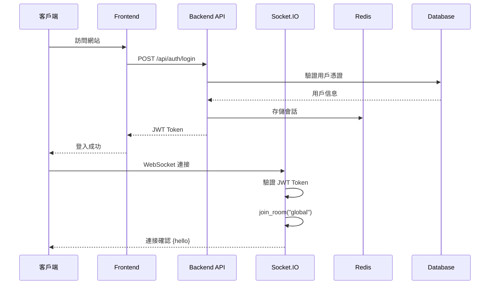
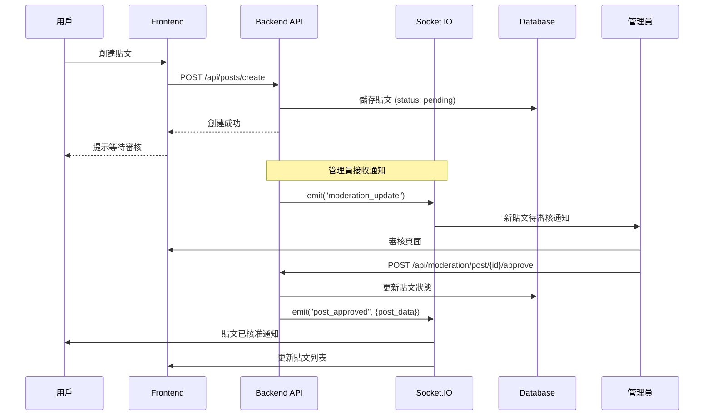
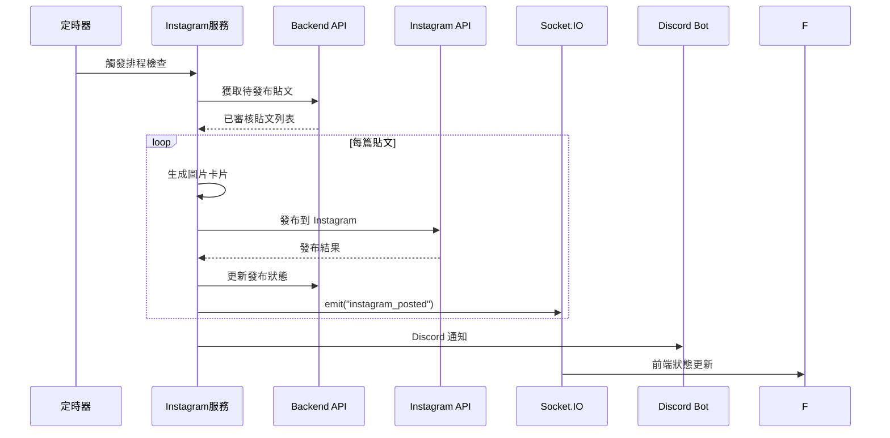
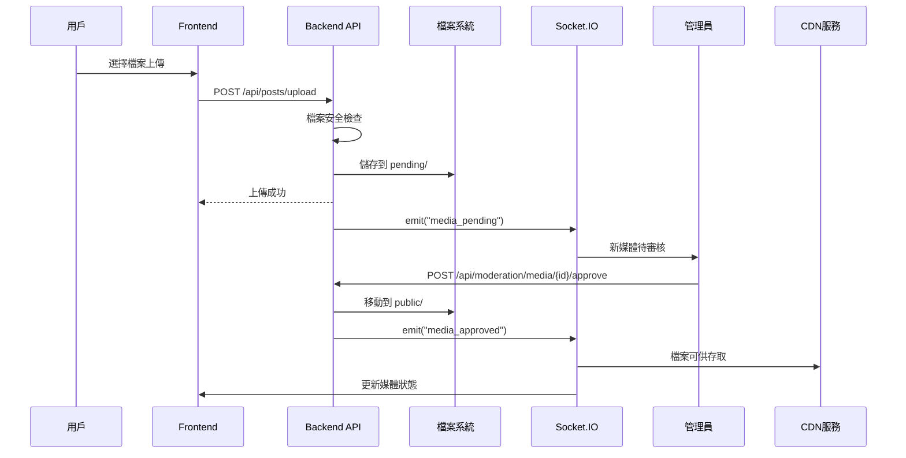
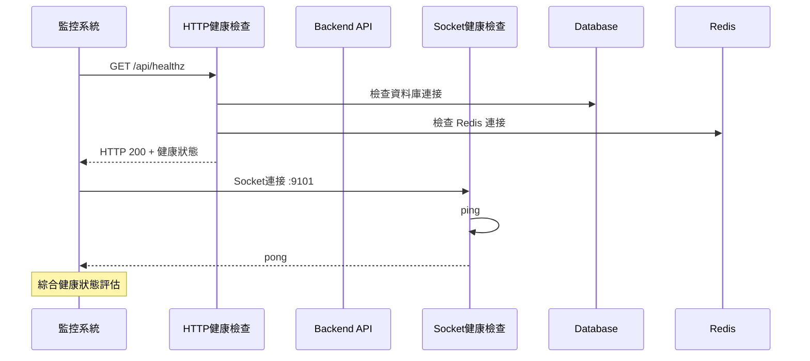
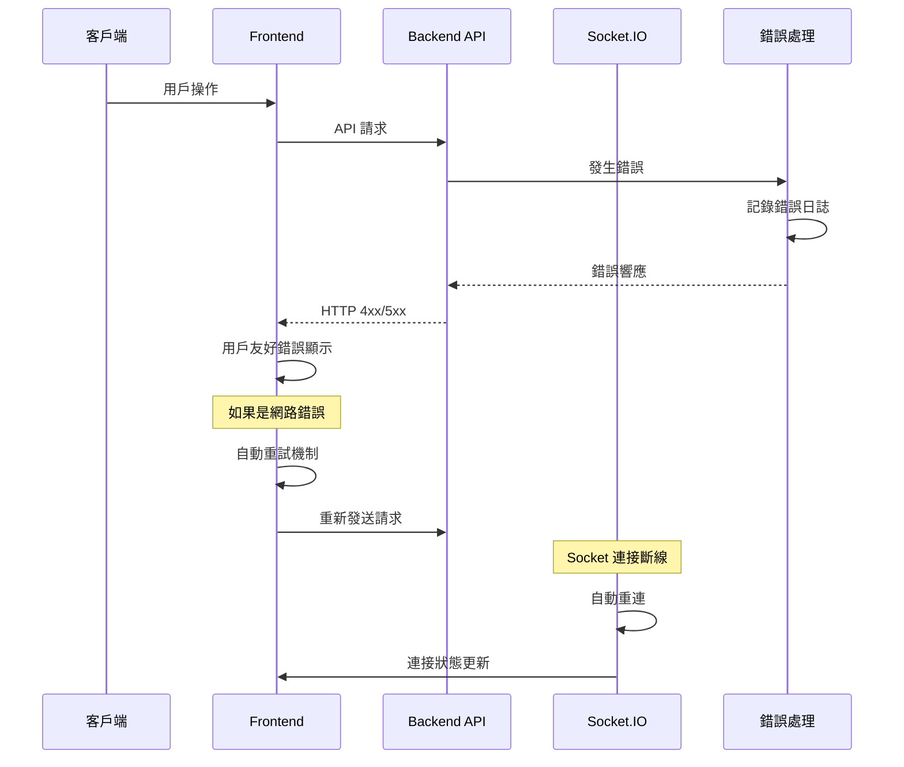
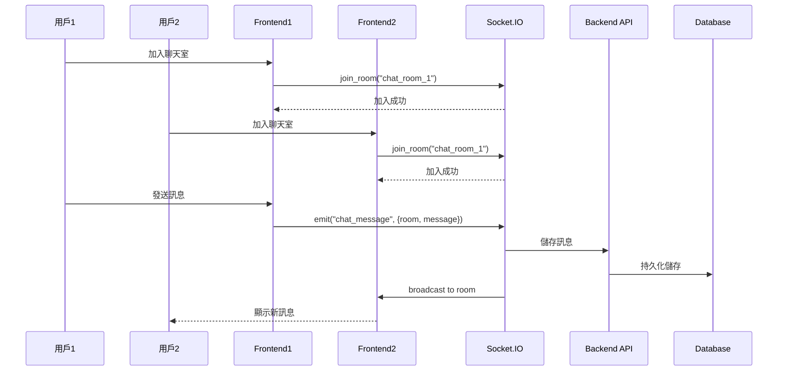

# Socket 與 HTTP 交互序列圖

本文檔描述 ForumKit 系統中 Socket 和 HTTP 服務之間的交互流程。

## 系統交互概覽

ForumKit 採用雙通道通訊架構：
- **HTTP API**: 用於標準的 CRUD 操作
- **Socket.IO**: 用於即時通訊和狀態廣播
- **原生 Socket**: 用於健康檢查和系統監控

## 核心交互流程

### 1. 用戶登入與連接建立

### 2. 貼文創建與審核流程

### 3. Instagram 自動發布流程

### 4. 媒體上傳與審核流程

### 5. 健康檢查機制

### 6. 錯誤處理與重試機制

### 7. 即時聊天功能

## Socket 事件類型

### 客戶端事件
- `connect`: WebSocket 連接建立
- `disconnect`: WebSocket 連接斷開
- `join_room`: 加入特定房間
- `leave_room`: 離開特定房間
- `chat_message`: 發送聊天訊息

### 服務端廣播事件
- `hello`: 連接確認
- `post_approved`: 貼文已核准
- `post_rejected`: 貼文被退件
- `media_approved`: 媒體已核准
- `moderation_update`: 審核狀態更新
- `instagram_posted`: Instagram 發布完成
- `system_announcement`: 系統公告

## HTTP API 端點

### 認證相關
- `POST /api/auth/login`: 用戶登入
- `POST /api/auth/logout`: 用戶登出
- `GET /api/auth/google`: Google OAuth 登入

### 內容管理
- `POST /api/posts/create`: 創建貼文
- `GET /api/posts/list`: 獲取貼文列表
- `GET /api/posts/{id}`: 獲取單個貼文
- `POST /api/posts/upload`: 上傳媒體檔案

### 審核管理
- `GET /api/moderation/queue`: 獲取待審核項目
- `POST /api/moderation/post/{id}/approve`: 核准貼文
- `POST /api/moderation/post/{id}/reject`: 退件貼文

### 系統監控
- `GET /api/status`: 基本狀態檢查
- `GET /api/healthz`: 詳細健康檢查

## 性能優化策略

### 1. 連接管理
- Socket 連接池管理
- 自動重連機制
- 心跳檢測 (ping/pong)

### 2. 資料快取
- Redis 會話快取
- API 響應快取
- Socket 房間狀態快取

### 3. 負載均衡
- Socket.IO 黏性會話
- API 無狀態設計
- 資料庫連接池

## 安全考量

### 1. WebSocket 安全
- JWT Token 驗證
- Origin 來源檢查
- Rate Limiting

### 2. API 安全
- CSRF 防護
- SQL 注入防護
- XSS 過濾

### 3. 資料傳輸安全
- HTTPS/WSS 加密
- 敏感資料脫敏
- 日誌安全處理

---

本序列圖文檔展示了 ForumKit 系統的核心交互流程。詳細的 API 文檔請參考 [架構文檔](./architecture.md)。